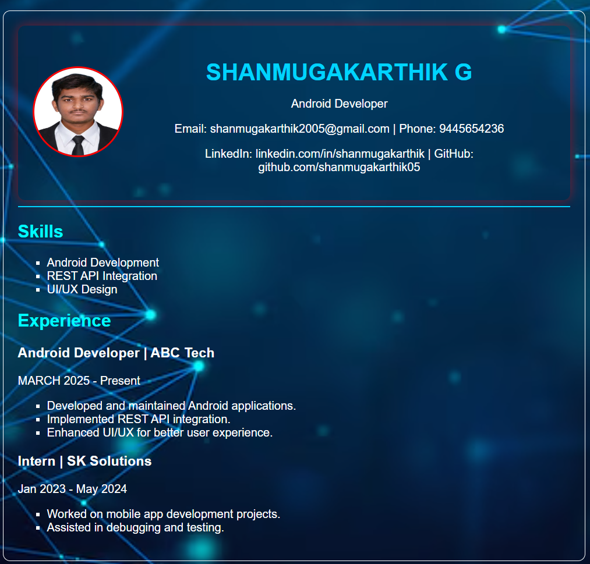

# Ex01 Portfolio
## Date:10/03/2025

## AIM
To create a Portfolio using HTML and CSS.

## ALGORITHM
### STEP 1
Create an HTML file (index.html)

### STEP 2
Create a CSS file (style.css)

### STEP 3
Include a navigation bar with links to different sections.

### STEP 4
Add structured sections for introduction, about, projects, and contact details.

### STEP 5
Define global styles for fonts, colors, and layout.

### STEP 6
Style the header, navigation bar, and sections.

### STEP 7
Use Flexbox or CSS Grid for layout design.

### STEP 8
Add hover effects and transitions for interactivity.

### STEP 9
Add Images and Media.

### STEP 10
Use optimized images for a professional look.

### STEP 11
Open the HTML file in a browser to check layout and functionality.

### STEP 12
Fix styling issues and refine content placement.

### STEP 13
Deploy the Portfolio.

### STEP 14
Upload to GitHub Pages for free hosting.

## PROGRAM
~~~
<!DOCTYPE html>
<html lang="en">
<head>
    <meta charset="UTF-8">
    <meta name="viewport" content="width=device-width, initial-scale=1.0">
    <title>Resume</title>
    <link rel="stylesheet" href="styles.css">
</head>
<body>
    

        <!-- Page 1 -->
        <section class="page">
            <header>
                

                    

                        
                    

                    

                        <h1>SHANMUGAKARTHIK G</h1>
                        
Android Developer

                        
Email: shanmugakarthik2005@gmail.com | Phone: 9445654236

                        
LinkedIn: linkedin.com/in/shanmugakarthik | GitHub: github.com/shanmugakarthik05

                    

                

            </header>
            

            <section>
                <h2>Skills</h2>
                <ul>
                    <li>Android Development</li>
                    <li>REST API Integration</li>
                    <li>UI/UX Design</li>
                </ul>
            </section>
            <section>
                <h2>Experience</h2>
                <h3>Android Developer | ABC Tech</h3>
                
MARCH 2025 - Present

                <ul>
                    <li>Developed and maintained Android applications.</li>
                    <li>Implemented REST API integration.</li>
                    <li>Enhanced UI/UX for better user experience.</li>
                </ul>
                <h3>Intern | SK Solutions</h3>
                
Jan 2023 - May 2024

                <ul>
                    <li>Worked on mobile app development projects.</li>
                    <li>Assisted in debugging and testing.</li>
                </ul>
            </section>
        </section>
        
        <!-- Page 2 -->
        <section class="page">
            <section>
                <h2>Projects</h2>
                <h3>Expense Tracker App</h3>
                
Built an Android app to track expenses with charts and analytics.

               
            </section>
            <section>
                <h2>Education</h2>
                <h3>Bachelor of Technology - Information Technology</h3>
                
Saveetha University | 2023 - 2027

            </section>
        </section>
    

</body>
</html>

~~~

## OUTPUT

## RESULT
The program for creating Portfolio using HTML and CSS is executed successfully.
